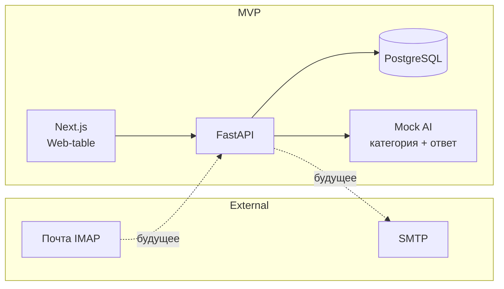

# Support MVP — AI-помощник обработки писем техподдержки

**Project name / Название проекта:** Support MVP (AI-assisted technical support email processing)

---

## 1. Цель MVP

Тестовое задание перед хакатоном: показать понимание архитектуры и заложить рабочий каркас веб-сервиса, где оператор техподдержки будет просматривать обращения (тикеты), категоризировать их с помощью ИИ и получать подсказки ответов. Полноценная разработка (реальная почта, продвинутые модели) планируется на хакатоне.

**Why this prototype exists:** Pre-hackathon deliverable to validate stack, DB schema, API design, and mock user flow without real email/ML dependencies.

---

## 2. Информация о команде / Team info

| Поле | Значение |
|------|----------|
| **Название команды** | [PLACEHOLDER: название команды] |
| **Участники и роли** | [PLACEHOLDER: участник 1 — бэкенд, участник 2 — фронтенд, участник 3 — ML, …] |
| **Тимлид** | [PLACEHOLDER: ФИО, Telegram @nickname] |

---

## 3. Ссылка на репозиторий

[PLACEHOLDER: https://github.com/your-org/support-mvp]

---

## 4. Что реализовано в MVP

- **Backend (FastAPI):** health, CRUD тикетов, категории, mock-анализ категории, mock-подсказка ответа, seed демо-данных, экспорт CSV, заглушки email (import/fetch/send).
- **Frontend (Next.js):** таблица тикетов, фильтры (поиск, статус, категория), форма добавления тикета, страница детали тикета, обновление статуса/категории, кнопки «Предложить категорию» и «Предложить ответ», экспорт CSV, кнопка «Seed демо».
- **БД:** PostgreSQL, схема: `categories`, `tickets`, `messages`, `ai_analyses`, `kb_articles`; миграции Alembic.
- **Инфра:** docker-compose (db + backend + frontend), .env.example, Makefile.
- **Режим по умолчанию:** mock/manual — без реальной почты и без API-ключей ИИ.

---

## 5. Пользовательский путь оператора (User journey)

### MVP (текущий сценарий)

1. Оператор открывает веб-интерфейс (таблицу обращений).
2. Обращения создаются вручную через форму «Добавить обращение» или подгружаются кнопкой «Seed демо» (реальная почта не подключается).
3. Оператор фильтрует список по поиску, статусу и категории.
4. Открывает тикет, просматривает тему, текст, отправителя.
5. Нажимает «Предложить категорию» — получает mock-категорию и уверенность.
6. Нажимает «Предложить ответ» — получает шаблонный текст ответа.
7. Меняет статус/категорию/приоритет и сохраняет.
8. При необходимости экспортирует таблицу в CSV.

### Будущий сценарий (после интеграции IMAP/SMTP)

1. Письма поступают в ящик техподдержки (IMAP).
2. Сервис периодически забирает новые письма и создаёт тикеты.
3. Оператор видит их в той же таблице, анализирует с помощью ИИ, правит ответ и отправляет через SMTP.

Краткая таблица:

| Шаг | MVP | После хакатона |
|-----|-----|----------------|
| Поступление обращения | Вручную / Seed | IMAP (авто) |
| Просмотр | Веб-таблица | Веб-таблица |
| Категоризация | Mock по ключевым словам | Модель (OpenAI/HF) |
| Подсказка ответа | Шаблоны | LLM / шаблоны |
| Отправка ответа | Нет | SMTP |

---

## 6. Архитектура системы

Компоненты:

- **Mail intake (приём почты):** сейчас — ручной ввод и seed; в будущем — IMAP-адаптер.
- **AI-agent:** mock-категоризация и подсказка ответа; позже — OpenAI/HuggingFace.
- **Knowledge base:** таблица `kb_articles` (заглушка для будущего поиска по базе знаний).
- **Database:** PostgreSQL (тикеты, сообщения, категории, анализы ИИ, kb_articles).
- **Web-table / Dashboard:** Next.js — список, фильтры, детали, формы.
- **Reply sending:** сейчас — только подсказка текста; в будущем — SMTP-адаптер.

Взаимодействие: фронтенд обращается к API бэкенда; бэкенд читает/пишет БД, вызывает mock-ИИ и (в будущем) почтовые адаптеры.



---

## 7. Структура проекта

```
/
├── README.md
├── .gitignore
├── .env.example
├── docker-compose.yml
├── Makefile
├── backend/
│   ├── Dockerfile
│   ├── requirements.txt
│   ├── alembic.ini
│   ├── alembic/
│   │   ├── env.py
│   │   ├── script.py.mako
│   │   └── versions/
│   │       └── 001_initial_schema.py
│   ├── app/
│   │   ├── __init__.py
│   │   ├── main.py
│   │   ├── config.py
│   │   ├── db.py
│   │   ├── models/
│   │   ├── schemas/
│   │   ├── routers/
│   │   ├── services/
│   │   ├── repositories/
│   │   ├── core/
│   │   └── utils/
│   └── scripts/
│       └── seed_demo.py
├── frontend/
│   ├── Dockerfile
│   ├── package.json
│   ├── tsconfig.json
│   ├── next.config.js
│   ├── app/
│   │   ├── layout.tsx
│   │   ├── page.tsx
│   │   ├── globals.css
│   │   ├── types.ts
│   │   └── tickets/[id]/page.tsx
│   └── lib/
│       └── api.ts
└── docs/
    └── (optional architecture.md)
```

---

## 8. API endpoints

| Метод | Путь | Описание |
|-------|------|----------|
| GET | /health | Проверка работы сервиса |
| GET | /api/categories | Список категорий |
| POST | /api/categories | Создание категории |
| GET | /api/tickets | Список тикетов (query: search, status, category_id, limit, offset) |
| POST | /api/tickets | Создание тикета |
| GET | /api/tickets/export.csv | Экспорт тикетов в CSV |
| GET | /api/tickets/{id} | Тикет по ID |
| PATCH | /api/tickets/{id} | Обновление тикета |
| POST | /api/tickets/{id}/analyze | Mock-анализ категории |
| POST | /api/tickets/{id}/suggest-reply | Mock-подсказка ответа |
| POST | /api/seed-demo | Заполнение демо-данными |
| POST | /api/email/import-mock | Заглушка импорта |
| POST | /api/email/fetch | 501 в mock-режиме |
| POST | /api/email/send | 501 в mock-режиме |

---

## 9. Схема БД

- **categories:** id, name (unique), description, created_at  
- **tickets:** id, external_id, sender_email, sender_name, subject, body, status, priority, category_id (FK → categories), source, received_at, created_at, updated_at  
- **messages:** id, ticket_id (FK → tickets), direction, channel, raw_text, parsed_text, subject, sender_email, recipient_email, created_at  
- **ai_analyses:** id, ticket_id (FK → tickets), predicted_category, confidence, suggested_reply, provider, model_version, latency_ms, created_at  
- **kb_articles:** id, title, content, tags, source_url, created_at, updated_at  

Связи: ticket → category (many-to-one), ticket → messages (one-to-many), ticket → ai_analyses (one-to-many).

---

## 10. Риски и способы минимизации

| Риск | Митигация |
|------|-----------|
| **Нестабильность интеграции с почтой (IMAP/SMTP)** | В MVP почта не используется; интерфейсы и заглушки подготовлены; тесты без реального ящика. |
| **Качество/задержки ИИ** | Mock-провайдер по умолчанию; абстракция провайдера; на хакатоне — ограничить размер ответа и таймауты. |
| **Нехватка размеченных данных** | Seed-данные и ключевые слова для демо; на хакатоне — мало-shot промпты или готовые датасеты. |
| **Нехватка времени на хакатоне** | Чёткий MVP уже поднят; план развития в README; приоритет: один сценарий «приём → ответ». |
| **Проблемы деплоя** | Docker Compose для локального запуска; один контейнер backend с миграциями при старте. |
| **Ошибки миграций БД** | Одна начальная миграция Alembic; тестировать миграции до коммита. |
| **Расхождения контракта FE/BE** | Pydantic и TypeScript-типы; один список эндпоинтов в README. |
| **Безопасность и приватность** | Нет секретов в коде; .env.example без значений; в прод — HTTPS, ограничение CORS, аудит логов. |

---

## 11. План развития на хакатоне (Next steps)

1. Подключить реальный IMAP (чтение писем) и SMTP (отправка ответов) по флагу/конфигу.  
2. Интегрировать провайдера ИИ (OpenAI-compatible или Hugging Face) с сохранением mock по умолчанию.  
3. Улучшить категоризацию и подсказку ответа (prompt engineering или мелкая модель).  
4. Добавить поиск по базе знаний (kb_articles) для подсказок.  
5. Улучшить UI: история сообщений по тикету, отправка ответа из интерфейса.  
6. Опционально: экспорт в XLSX, уведомления.

---

## 12. Инструкция по запуску

### Быстрый старт (рекомендуется)

```bash
git clone --branch support-mvp https://github.com/bekirs01/visionenigma.git
cd visionenigma

# Windows:
setup.bat

# Linux/Mac:
chmod +x setup.sh && ./setup.sh
```

Скрипт установит зависимости и запросит OpenAI API ключ для AI-агента.

### Запуск серверов (в двух терминалах)

**Терминал 1 — Backend:**
```bash
cd backend
python -m uvicorn app.main:app --reload --port 8000
```

**Терминал 2 — Frontend:**
```bash
cd frontend
npm run dev
```

Открыть http://localhost:3000

### Настройка OpenAI (для AI-агента)

Добавьте в `backend/.env`:
```
OPENAI_API_KEY=ваш_ключ
```

Без ключа AI работает в mock-режиме (шаблонные ответы).

### Docker

```bash
cp .env.example .env
docker-compose up -d
```

Миграции выполняются при старте контейнера backend. После запуска:

- Frontend: http://localhost:3000  
- Backend API: http://localhost:8000  
- Документация API: http://localhost:8000/docs  

Демо-данные: `make seed` или `curl -X POST http://localhost:8000/api/seed-demo`.

---

## 13. Demo-сценарий для жюри (без реальной почты)

1. Запустить проект: `docker-compose up -d` (или локально backend + frontend).  
2. Открыть http://localhost:3000.  
3. Нажать «Seed демо» — в таблице появятся несколько тикетов.  
4. В фильтрах выбрать статус «Новый» или категорию.  
5. Нажать «Добавить обращение» — заполнить email, тему, текст — создать тикет.  
6. Открыть любой тикет по ссылке «Открыть».  
7. Нажать «Предложить категорию» — проверить предсказанную категорию и уверенность.  
8. Нажать «Предложить ответ» — проверить текст подсказки.  
9. Изменить статус на «В работе» или категорию и нажать «Сохранить».  
10. Вернуться к списку, нажать «Экспорт CSV» — проверить выгрузку.  

Реальная почта и API-ключи не требуются.

---

## 14. Обоснование стека (Tech stack rationale)

- **FastAPI:** быстрый старт, автодокументация, Pydantic, асинхронность при необходимости.  
- **Next.js (App Router) + TypeScript:** единый фронт, SSR при необходимости, типизация.  
- **PostgreSQL:** надёжная реляционная БД, подходит для тикетов и связей.  
- **SQLAlchemy + Alembic:** ORM и миграции, привычный стек для Python.  
- **Docker Compose:** воспроизводимый запуск db + backend + frontend за одну команду.

---

## 15. Ограничения MVP

- Реальная почта (IMAP/SMTP) не подключена; работа только в режиме mock/manual.  
- ИИ — детерминированный mock (ключевые слова + шаблоны ответов).  
- База знаний (kb_articles) не используется в логике, только таблица в БД.  
- Отправка ответа клиенту из интерфейса не реализована (только подсказка текста).  
- Нет аутентификации и разграничения прав.  
- Экспорт только CSV (не XLSX).

---

## 16. Как позже подключить реальную почту

В `.env` задать:

- `EMAIL_MODE=imap_smtp` (или отдельные флаги по необходимости).  
- IMAP: `IMAP_HOST`, `IMAP_PORT`, `IMAP_USER`, `IMAP_PASS`.  
- SMTP: `SMTP_HOST`, `SMTP_PORT`, `SMTP_USER`, `SMTP_PASS`.  

В коде уже есть интерфейсы `EmailFetcher` и `EmailSender` и заглушки `ImapEmailFetcher`, `SmtpEmailSender`. Достаточно реализовать методы (например, через `imaplib`/`smtplib`) и подключать соответствующий класс в зависимости от `EMAIL_MODE`. Периодическая задача (cron или фоновая job) будет вызывать `fetch_new_messages()` и создавать тикеты через существующий `POST /api/tickets`.
